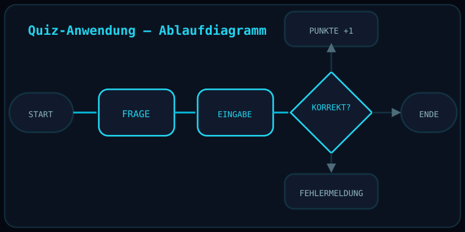

# Quiz-Anwendung (Quiz Application)

  

> **Status note:** This repository currently contains **documentation only**. The original Python source files for this personal project have not yet been uploaded here. This README describes the project honestly based on the actual work completed; no code shown here is fabricated. Source files will be added once uploaded.

## Overview

An interactive Python quiz application with scoring logic, input validation, and structured error handling.

## Objective

Build a functional, robust application that reliably processes user input and calculates the score correctly and transparently.

## Technologies

| Category | Tools |
|---|---|
| Language | Python |

## Technical Concepts

- Scoring logic
- Input validation
- Structured error handling (exception handling)
- Control flow design

## Approach

1. Design the question/answer flow.
2. Implement the scoring logic.
3. Harden the application against invalid input via validation and error handling.
4. Iteratively test the full flow.

## Challenges

- Covering as many invalid-input cases as possible.
- Cleanly separating program logic from user interaction.

## Skills Demonstrated

- Structured Python programming
- Robust input validation
- Exception handling

## Possible Extensions

- Add a graphical user interface.
- Add persistent high-score storage.
- Add multiplayer or category-based functionality.

## License

MIT — see [LICENSE](LICENSE).

## Author

**Abdellatif Ali** — B.Sc. Elektro- und Informationstechnik, Hochschule Hannover
[LinkedIn](https://linkedin.com/in/abdellatif-ali-b34295362)
